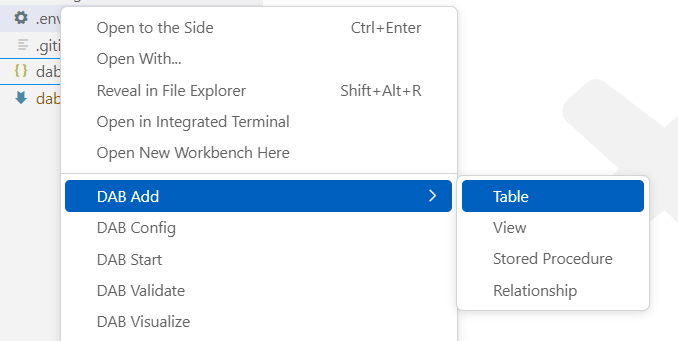
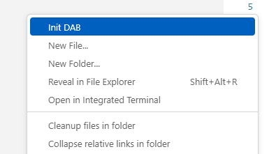
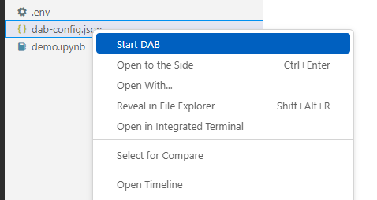
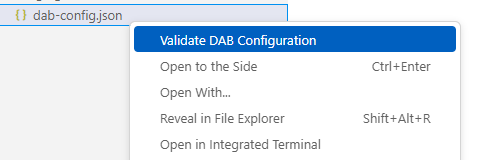
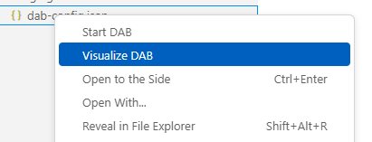
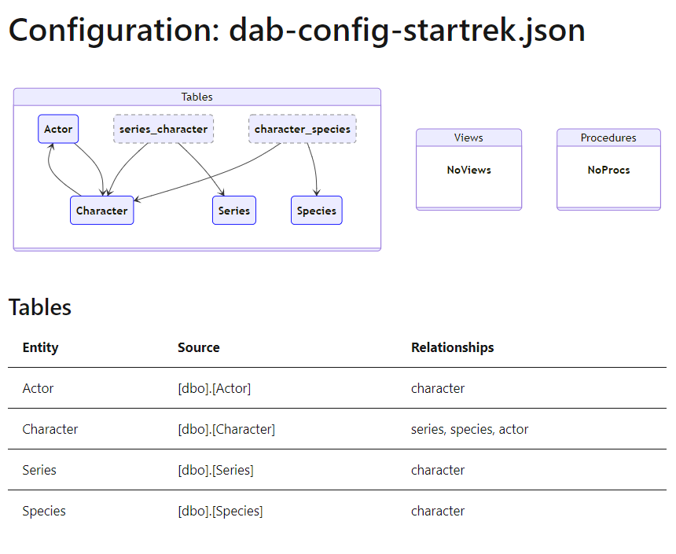

# data-api-builder-vscode-ext

This is a family of VS Code extensions for Data API builder that make most of the basic operations a matter of menu options instead of using the CLI. Having said that, the extensions use the CLI under the hood. 

## Extensions

### add-data-api-builder
An easy way to run `DAB Add` from a config file. Supports Tables, Views, Stored Procedures, and Relationships. 

### init-data-api-builder
An easy way to run `DAB Init` from a folder. Also supports Static Web Apps. 

### start-data-api-builder
An easy way to run `DAB Start` from a config file.

### validate-data-api-builder
An easy way to run `DAB Validate` from a config file. 

### visualize-data-api-builder
An easy way to see your config file rendered as a [Mermaid](https://mermaid.js.org/) chart. 

### health-data-api-builder
An easy way to check the health status of a running DAB instance.

### poco-data-api-builder
An easy way to generate .NET POCO models from config entities.

### agent-data-api-builder
GitHub Copilot `@dab` chat participant for natural language interaction with Data API Builder.

### omnibus-data-api-builder
All Data API builder extensions in one package.
