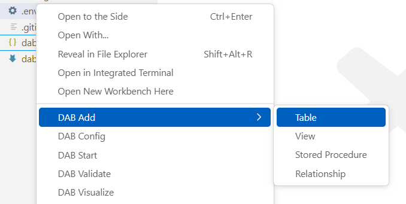

# data-api-builder-vscode-ext

This is a family of VS Code extensions for Data API builder that make most of the basic operations a matter of menu options instead of using the CLI. Having said that, the extensions use the CLI under the hood. 

# add-data-api-builder
An easy way to run `DAB Add` from a config file. Supports Tables, Views, Stored Procedures, and Relationships. 

# init-data-api-builder
An easy way to run `DAB Init` from a folder. Also supports Static Web Apps. 

# start-data-api-builder
An easy way to run `DAB Start` from a config file.

# validate-data-api-builder
An easy way to run `DAB Validate` from a config file. 

# visualize-data-api-builder
An easy way to see your config file rendered as a [Mermaid](https://mermaid.js.org/) chart. 

# config-data-api-builder
An easy way to edit runtime settings in the config file.
> _coming soon_

# poco-data-api-builder
An easy way to generate .NET POCPO models from config entities.
> _coming soon_
