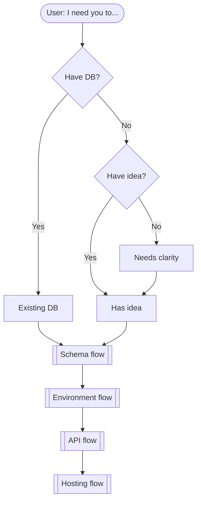
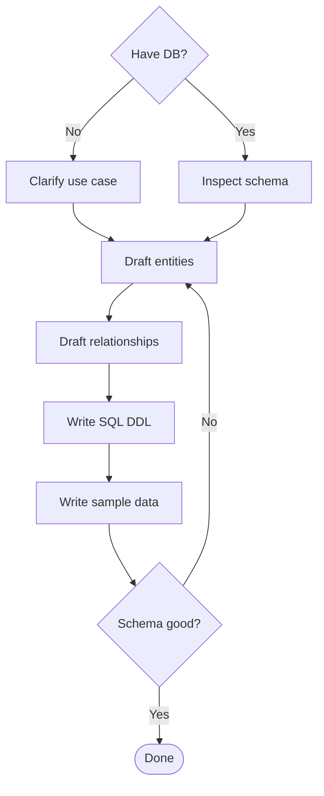
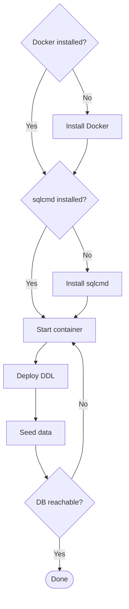
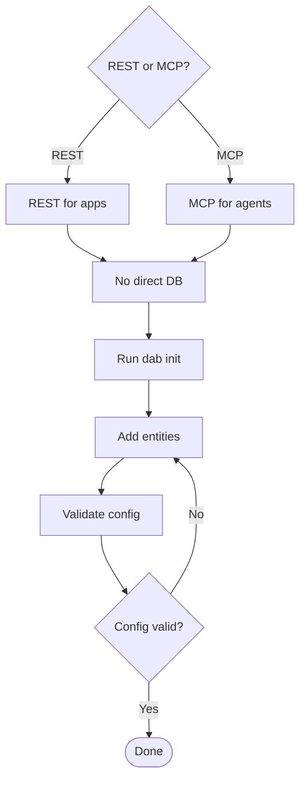
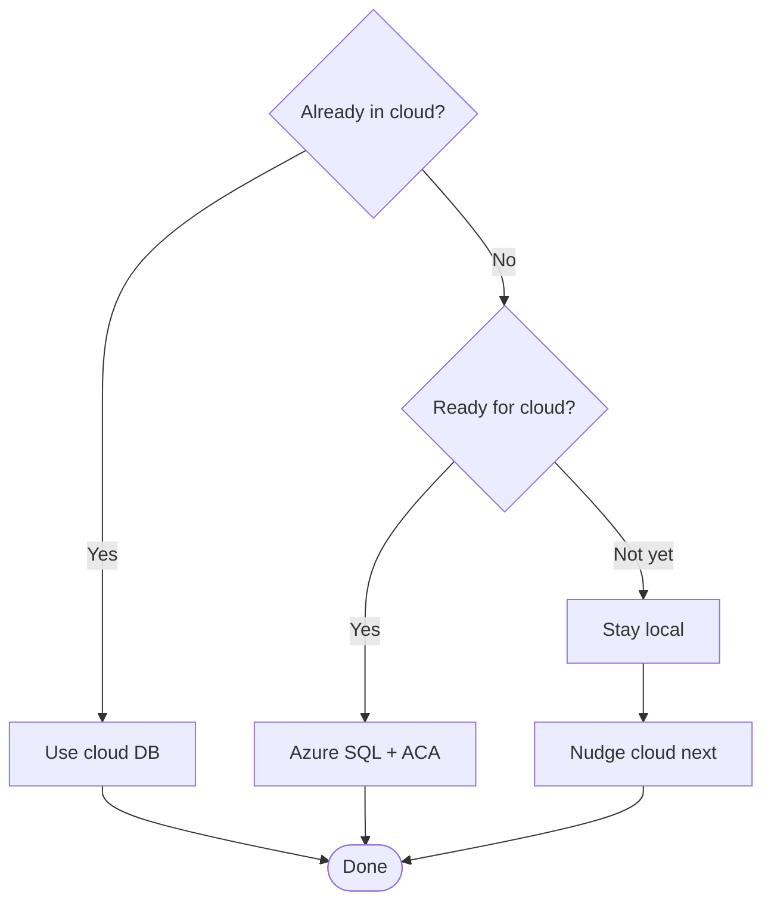
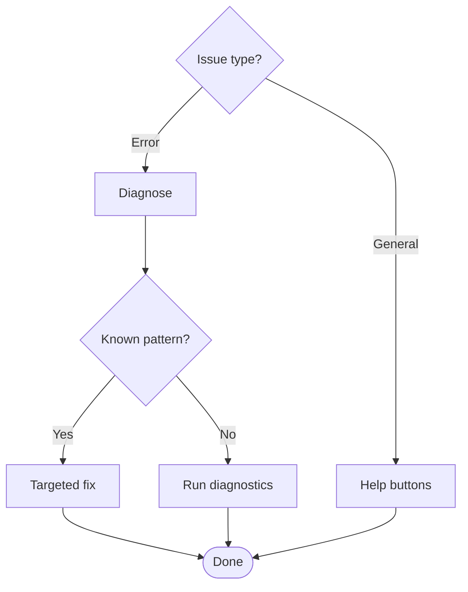

# DAB Agent Flow (chat participant)

This outlines how the `@dab` chat participant processes requests, including decision points and tool usage.

## Mermaid workflows

### 1. Uber: user journey

### 2. Schema design

### 3. Environment prep

### 4. Data API

### 5. Hosting

### 6. Help / Fix

## High-level branches
1) Extension activation
   - Trigger: VS Code startup (`onStartupFinished`).
   - Actions: register LM tools (`dab_cli`, `get_schema`), register chat participant, set icon and followups. Sources: [src/extension.ts](src/extension.ts), [src/tools/chatTools.ts](src/tools/chatTools.ts).

2) Entry perspective
   - Users may arrive with an existing DB, an idea needing a schema, or no environment yet.
   - We capture intent, clarify goals, and prepare tools (Docker/sqlcmd) before deeper steps.

3) Schema-first flow (default)
   - Capture use case and data needs; propose entities and relationships.
   - Generate SQL DDL plus sample data scripts; no DB required until user opts to test locally.
   - If user wants a dry-run: deploy schema to Docker/local SQL and seed data; otherwise keep planning.

4) Environment prep flow
   - Detect Docker/sqlcmd readiness; install/start if missing.
   - Verify connectivity; seed sample DB for quick tests.

5) Data API flow (after schema agreement)
   - Choose surface: REST or MCP (agent vs app). Reinforce that apps/agents never hit the DB directly.
   - Run `dab init` when schema is set; build/merge `dab-config*.json` accordingly, keeping entity/relationship alignment.
   - Validate config and stream outputs; offer follow-ups.

6) Deploy/host guidance
   - Prefer cloud: Azure SQL for data + DAB running in Azure Container Apps.
   - If local is required (Docker/local SQL), support it but nudge toward cloud migration next.

7) Help / troubleshooting
   - Help intents → `handleHelp()` (buttons + short explainer).
   - Fix intents → `handleFix()` for targeted remedies (connection, port, CORS, view key-fields) and a quick diagnostic table; validation button when config exists.

8) LLM + tools loop (`handleWithLLM`)
   - Build system prompt from bundled instructions (merge main `dab-developer.agent.md` then sorted child docs). Source: [src/instructions.ts](src/instructions.ts).
   - Build workspace context: locate `dab-config*.json`, summarize entities/relationships, find connection strings from `.env`/`local.settings.json`.
   - Iterate tool calls (up to 10 rounds) using `dab_cli` and `get_schema`; stream partial responses.

9) Tools (registered in `src/tools/chatTools.ts`)
   - `dab_cli`: wraps DAB CLI subcommands (init/add/update/configure/validate/start/status), auto-loads `.env`, honors `--config`, can start in background, normalizes flags (e.g., `relationshipFields` → `relationship.fields`).
   - `get_schema`: SQL Server schema discovery; supports filters (tables/views/procs/functions/summary), returns objects + foreign-key relationships for relationship planning.

10) Follow-ups
   - After schema/API progress → suggest “Add entities”, “Validate config”, “Start DAB” as appropriate.
   - After help → “Initialize DAB”, “Learn more”.

11) Operational tips
   - Keep `npm run watch` running so the participant always has `out/` artifacts.
   - Ensure Docker Desktop is started before local schema tests; surface installer links when missing.
   - Place connection strings in `.env` (e.g., `DATABASE_CONNECTION_STRING`) so the agent surfaces and reuses them.

## Fast reference: decision tree (text)
- Activation → tools + participant registered
   - User prompt: “I need you to…”
   - Assess state: existing DB vs idea vs unclear
   - Schema design → propose entities + sample data → optional local deploy
   - Environment → ensure Docker/sqlcmd; seed sample DB
   - Data API → choose REST or MCP; no direct DB; run `dab init`; validate config
   - Hosting → cloud (Azure SQL + ACA) or local (Docker/SQL)
   - Help / Fix → buttons or targeted remedies → tool loop (`dab_cli`, `get_schema`) as needed