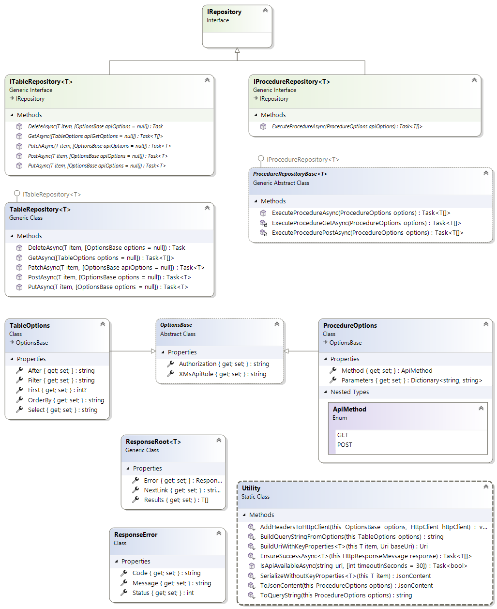

## Microsoft.DataApiBuilder.Rest

This library helps apps consume an Data API builder REST API.

## Getting Started

Sample database: https://aka.ms/dab/startrek

Add the NuGet package to your project:
```bash
dotnet add package Microsoft.DataApiBuilder.Rest
```

Create your model.

```csharp
public record class Actor(int Id, string Name, int BirthYear);
```

Create your repository.

```csharp
const string URL = "http://localhost:5000";

var entityUri = new Uri(URL + "/api/Actor");
var repository = new TableRepository<Actor>(entityUri);
```

Verify your API is available.

```csharp
if (!await Utility.IsApiAvailableAsync(URL))
{
    // handle problem
}
```

Fetch data from your API.


```csharp
var actors = await repository.GetAsync();

foreach (var actor in actors)
{
    Console.WriteLine(actor);
}

```

View output.

```sh
Actor { Id = 1, Name = William Shatner, BirthYear = 1931 }
Actor { Id = 2, Name = Leonard Nimoy, BirthYear = 1931 }
Actor { Id = 3, Name = DeForest Kelley, BirthYear = 1920 }
Actor { Id = 4, Name = James Doohan, BirthYear = 1920 }
Actor { Id = 5, Name = Nichelle Nichols, BirthYear = 1932 }
Actor { Id = 6, Name = George Takei, BirthYear = 1937 }
Actor { Id = 7, Name = Walter Koenig, BirthYear = 1936 }
Actor { Id = 8, Name = Patrick Stewart, BirthYear = 1940 }
Actor { Id = 9, Name = Jonathan Frakes, BirthYear = 1952 }
Actor { Id = 10, Name = Brent Spiner, BirthYear = 1949 }
Actor { Id = 11, Name = Michael Dorn, BirthYear = 1952 }
Actor { Id = 12, Name = Gates McFadden, BirthYear = 1949 }
Actor { Id = 13, Name = Marina Sirtis, BirthYear = 1955 }
Actor { Id = 14, Name = LeVar Burton, BirthYear = 1957 }
```


## Classes and Types

