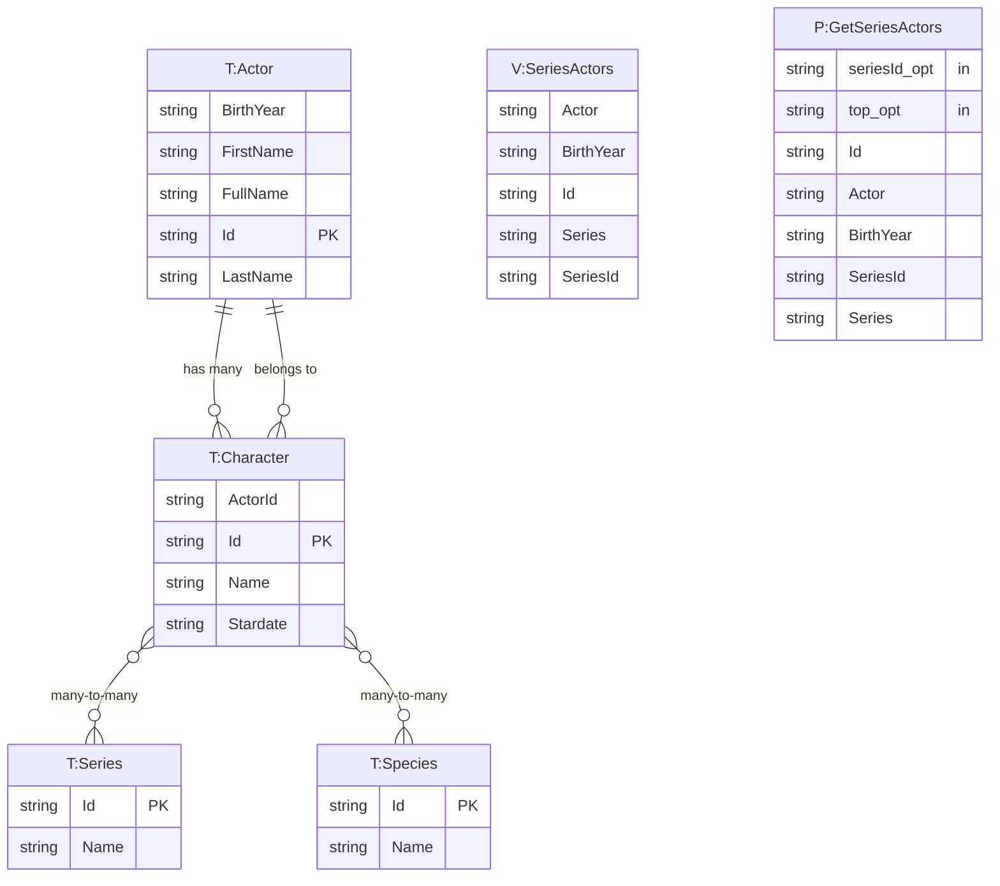

# Test Mermaid Output

```mermaid
erDiagram

  "T:Actor" {
    string BirthYear
    string FirstName
    string FullName
    string Id PK
    string LastName
  }
  "T:Character" {
    string ActorId
    string Id PK
    string Name
    string Stardate
  }
  "T:Series" {
    string Id PK
    string Name
  }
  "T:Species" {
    string Id PK
    string Name
  }

  "T:Actor" ||--o{ "T:Character" : "has many"
  "T:Character" }o--|| "T:Actor" : "belongs to"
  "T:Character" }o--o{ "T:Series" : "many-to-many"
  "T:Character" }o--o{ "T:Species" : "many-to-many"

  "V:SeriesActors" {
    string Actor
    string BirthYear
    string Id
    string Series
    string SeriesId
  }

  "P:GetSeriesActors" {
    string seriesId_opt "in"
    string top_opt "in"
    string Id
    string Actor
    string BirthYear
    string SeriesId
    string Series
  }
```
